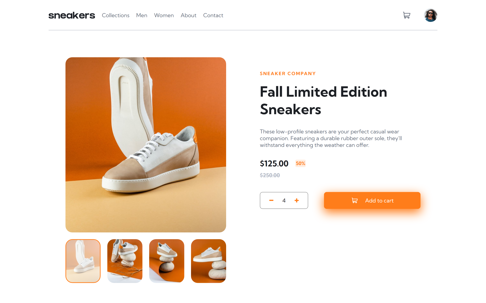

# Frontend Mentor - E-commerce product page solution

This is a solution to the [E-commerce product page challenge on Frontend Mentor](https://www.frontendmentor.io/challenges/ecommerce-product-page-UPsZ9MJp6). Frontend Mentor challenges help you improve your coding skills by building realistic projects.

## Table of contents

- [Overview](#overview)
  - [The challenge](#the-challenge)
  - [Screenshot](#screenshot)
  - [Links](#links)
- [My process](#my-process)
  - [Built with](#built-with)
  - [What I learned](#what-i-learned)


## Overview

### The challenge

Users should be able to:

- View the optimal layout for the site depending on their device's screen size
- See hover states for all interactive elements on the page
- Open a lightbox gallery by clicking on the large product image
- Switch the large product image by clicking on the small thumbnail images
- Add items to the cart
- View the cart and remove items from it

### Screenshot


.png)
.png)
.png)
.png)
.png)
.png)
.png)


### Links

- Solution URL: [Add solution URL here](https://your-solution-url.com)
- Live Site URL: [Add live site URL here](https://your-live-site-url.com)

## My process

### Built with
- Semantic HTML5 markup
- CSS custom properties
- Flexbox
- CSS Grid

### What I learned


```js
for (const iterator of thumbArr) {
      if (element === iterator) {
        iterator.style.border = "2px solid hsl(26, 100%, 55%)";
        iterator.children[0].style.opacity = "0.4";
        preview.children[0].src = srcArr[item].src;
        preview.children[0].setAttribute("alt", srcArr[item].alt);
      } else {
        iterator.style.border = "none";
        iterator.children[0].style.opacity = "1";
      }
    }
```


## Author
- Frontend Mentor - [@yourusername](https://www.frontendmentor.io/profile/yourusername)
- Twitter - [@yourusername](https://www.twitter.com/yourusername)


